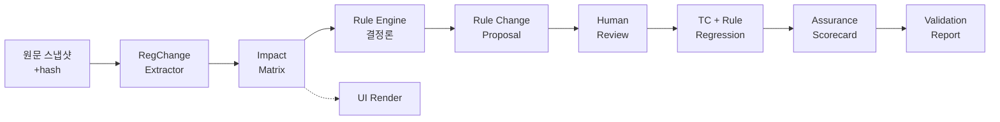

# RegImpact AI

> **생성형 AI 기반 주택담보대출 규제 변경 영향분석 및 검증 시스템**
> RegChange AI — Financial Policy Impact & Assurance Lab

규제가 바뀌었을 때 **무엇을 고쳐야 하는지 AI가 제안하고, 그 제안이 틀리지 않았는지
검증 가능한(auditable) 방식으로 증명**하는 의사결정 지원 시스템. 챗봇이 아니다.

- **제품(E)** = 규제 변경 영향분석 (RegChange / Impact Analysis)
- **신뢰 기반(A)** = AI 결과의 검증·통제 (Assurance Layer)
- 가치 제안: "정확한 자동화"가 아니라 **검증 가능한 초안화 + 실패의 명시적 통제.**

> 용도: 이직 포트폴리오 — 금융권 Model Risk / 모델검증 / AI Governance / AI Assurance 직무.
> 작업을 **이어받는 경우**(새 Claude 세션 포함)는 아래 [인계 안내](#인계-안내-작업을-이어받는-경우)부터 읽으세요.

---

## 핵심 결과 (6·30 규제지역 추가 지정, 앵커 시나리오)

| 항목 | 결과 |
|---|---|
| **E2E 파이프라인** | 원문 → 추출 → 영향 → 룰판정 → 제안 → 검증까지 **전 노드 관통** (`pipeline_complete=True`) |
| **Assurance (4 dimension, 12지표)** | **12/12 PASS → 종합 PASS** (확정 임계값 Strict, 고위험 FAIL→전체 FAIL) |
| **룰 회귀 (3계층)** | seed 30 / 큐레이션 106 / 조합 격자 **3,200** — 전부 **100%** (엔진 ⟷ 독립 명세 오라클) |
| **환각** | Citation 100% · Unsupported 0% · Contradiction 0% — **관측 0** |
| **방어력** | mutation(엔진 버그 주입) 시 회귀·스코어카드가 실패로 포착 |
| **테스트** | **110개** 전량 통과 (결정론, 재현 가능) |

핵심 설계 원칙: **확률론 축(LLM 추출)과 결정론 축(룰엔진)을 분리**하고, 룰엔진을 LLM 출력의
검증 기준점(ground truth)으로 쓴다. 규칙 값·우선순위는 사람이 확정한 명세에서만 오며,
LLM은 규칙을 생성하거나 금융 의사결정을 실행하지 않는다.

---

## 30초 Quickstart

```bash
pip install pytest                          # 유일한 필수 의존성 (LLM API 키 불필요)
python -m pytest                            # 110개 통과
python examples/demo_e2e.py                 # E2E 관통 → 검증보고서 생성
```

`demo_e2e.py`는 6·30 시나리오를 원문 추출부터 검증보고서까지 관통시키고
`docs/reports/validation_6_30.{md,html}`를 생성한다.

---

## 파이프라인



각 노드는 구조화 스키마로 연결되고, 모든 판정은 `reason_code`·`source_policy_id`·`citation`으로
추적 가능하다. 노드별 상세는 `docs/features/workflow-e2e/`(최신 v7).

---

## 데모 (전부 API 키 불필요, 결정론)

| 스크립트 | 무엇을 보여주나 | 산출물 |
|---|---|---|
| `demo_e2e.py` | 원문→추출→영향→제안→검증 **E2E 관통** | `reports/validation_6_30.{md,html}` |
| `assurance_scorecard.py` | Assurance **4 dimension 12지표** 확정 임계값 판정 | `reports/assurance_scorecard.md` |
| `demo_portfolio.py` | 룰 평가셋 **큐레이션 106 + 격자 3,200** 통계 | `reports/rule_{portfolio,grid}_stats.md` |
| `measure_assurance_6_30.py` | 추출 Assurance 실측(grounding·골드 대조) | `reports/assurance_6_30.md` |
| `demo_retrieval.py` | RAG 검색(BM25) + **recall@k** 평가 | `reports/retrieval_stats.md` |
| `demo_impact_matrix.py` | 시행 전/후 세그먼트별 LTV 영향 매트릭스 | 콘솔 |
| `render_impact_ui.py` | 영향 매트릭스 데이터바인딩 HTML | `ui/generated/impact_matrix.html` |
| `demo_tc_regression.py` | 룰엔진 ⟷ 독립 오라클 차등검증(seed 30) | 콘솔 |
| `demo_6_30.py` | 룰엔진 단건 판정(8개 케이스) | 콘솔 |
| `run_extractor.py` | 실제 LLM 추출(**무료** Ollama 로컬 / Groq·Gemini 무료 키) | 콘솔 |

---

## 포트폴리오 산출물

거버넌스·검증 문서(모두 실측 근거, 버전 관리):

- **정식 검증보고서(약 17쪽):** `docs/reports/validation_report_6_30_full.md`
  — 모델검증 보고서 형식(방법론·Dimension별 발견·고위험 실패 분석·한계·권고).
- **Model/System Card:** `docs/cards/regchange-ai/` — System Card + LLM 컴포넌트 Model Card.
- **AI Risk Register:** `docs/risk/regchange-ai/` — 19건 5범주, 고유→통제→잔여위험.
- **PRD:** `docs/prd/regchange-ai/` — 브리프 §25 항목 + 구현 상태 매트릭스.
- **기능단위·워크플로우:** `docs/features/` — 버전별(vN) 스냅샷 + CHANGELOG.

---

## 저장소 구조

```
src/regimpact/
├── rule_engine.py, models.py, regions.py, grandfathering.py   # 결정론 LTV 룰엔진(알고리즘 H)
├── extractor/     # RegChange Extractor(E) + Citation Assurance(A)
├── impact/        # Impact Matrix(시행 전/후 temporal diff) + UI 렌더
├── proposal/      # Rule Change Proposal(AI초안→사람확정)
├── tc_generator/  # TC Generator + 3계층 회귀(독립 오라클 차등검증)
├── retrieval/     # RAG/Retrieval(BM25 어휘검색 + recall@k, 무료·결정론)
├── assurance/     # Assurance Scorecard(4 dimension + 확정 임계값)
└── validation/    # Validation Report(md + 정식 HTML)
tests/             # pytest 110개
examples/          # 데모 9종
docs/              # 브리프·상태판·명세·지표·features·prd·cards·risk·reports
```

## 현재 상태

🟢 **코어 완성선 도달** (브리프 §18 정의 충족). E2E 전 노드 관통 · Assurance 12/12 PASS ·
룰 3계층 100% · 정식 검증보고서·Card·Risk Register·PRD 완비. 상세: `docs/01_PROJECT_STATE.md`.

남은 스트레치: 자동 LLM API 실행(키 확보 시) · RAG/retrieval · 정식 audit trail · 다문서 골드셋 확대.

---

## 인계 안내 (작업을 이어받는 경우)

> ⚠️ 이 프로젝트는 개발 도중 Claude 계정이 교체된다. **모든 상태는 이 저장소 안에만** 존재한다.
> 대화 메모리에 의존하지 말 것. 매 작업 종료 시 `01_PROJECT_STATE.md`를 갱신하는 것이 규칙이다.

**읽는 순서:**

1. **`docs/01_PROJECT_STATE.md`** — 지금 어디까지 왔는지, 다음 액션 (가장 먼저!)
2. `docs/00_BRIEF.md` — 철학·범위·LOCKED 원칙 (정체성, 원본 보존)
3. `docs/02_DECISION_LOG.md` — 결정과 이유
4. `docs/04_PLAN.md` — 유효한 실행 계획
5. `docs/03_OPEN_QUESTIONS.md` — 사용자 확인 대기 항목
6. `docs/05_RULE_SPEC.md` · `docs/regulatory_facts.md` — 룰 명세·규제 사실(단일 기준점)
7. `docs/metrics_spec.md` — 지표·임계값
8. `docs/features/` — 기능단위·워크플로우(버전별). 규칙: `docs/features/_VERSIONING.md`

**버전 규칙:** PRD·기능단위·Card·Risk Register 등 문서는 수정 시 **새 버전 파일(vN)을 만들고**
이전 버전을 보존하며, 상단에 before→after를 기록하고 폴더 `CHANGELOG.md`에 누적한다
(`docs/features/_VERSIONING.md`).

**LOCKED 원칙 요약(임의 변경 금지, 상세 `00_BRIEF.md §0`):** E=제품/A=신뢰기반 · 검증 가능한
의사결정 지원(챗봇 아님) · 주담대 LTV 수직 슬라이스 · **룰 로직은 LLM이 생성하지 않음** ·
평가셋 DEV/LOCKED/CHALLENGE 분리 · 실제 회사문서·고객데이터 미사용 · 검증 가능성·추적 가능성 우선.

---

## 개발 브랜치

`claude/work-in-progress-d2et38`
